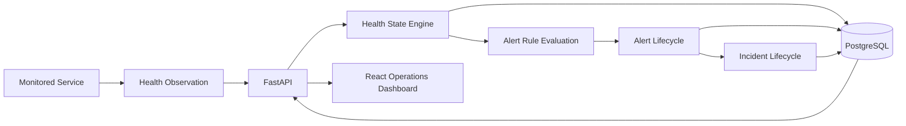

# SentinelOps

SentinelOps is a service-health monitoring and incident-management platform built with FastAPI, PostgreSQL, and React. It ingests health observations, evaluates service state using deterministic anti-flapping rules, generates rule-driven alerts, tracks outage incidents through recovery, and exposes operational state through a web dashboard.

```text
Health Observation → Health State → Alert → Incident → Recovery → Operations Dashboard
```

## What it demonstrates

- A deterministic service-health state machine with anti-flapping rules based on recent observations.
- PostgreSQL-backed health-state intervals and idempotent health-check ingestion.
- Rule-driven WARNING and CRITICAL alerts, with automatic incident creation for critical outages.
- An explicit `RECOVERING` state and failed-recovery handling that preserves the existing incident rather than opening a duplicate.
- Ordered incident event timelines and transactional health, alert, and incident processing.
- A React/TypeScript operations dashboard for services, alerts, incidents, and recovery history.
- Docker Compose and Codespaces reproducibility for the complete stack.

## Architecture



The FastAPI application is the system boundary for health observations and operational reads. PostgreSQL preserves the check history, health intervals, alert state, incidents, and ordered incident events. The React dashboard is a read-oriented client of that API.

## Operational flow: Payments API

The included Payments API scenario demonstrates the complete outage and recovery path:

```text
HEALTHY → DEGRADED → DOWN → RECOVERING → HEALTHY
```

- `DEGRADED` can activate a WARNING alert.
- `DOWN` activates a CRITICAL alert and opens an incident.
- `DOWN → RECOVERING` clears the DOWN alert but keeps the incident open.
- `RECOVERING → HEALTHY` resolves the incident.
- `RECOVERING → DOWN` keeps the same incident open rather than creating another outage record.

This avoids treating a failed recovery as a second outage when it is part of the same operational event.

## Stack

- Backend: Python 3.11, FastAPI, SQLAlchemy async, Alembic, Pydantic
- Data: PostgreSQL with asyncpg
- Frontend: React, TypeScript, Vite
- Tooling: Docker Compose, pytest, Vitest, GitHub Codespaces

## Run locally

```bash
cp .env.example .env
docker compose up --build
```

Open the dashboard at `http://localhost:5173`. The API is available at `http://localhost:8000`; `/health` is liveness and `/ready` verifies database connectivity.

To populate the deterministic demo scenario in a running stack:

```bash
docker compose exec api python /app/scripts/seed_demo.py
python simulator/payments_scenario.py
```

## Verification

The repository includes end-to-end backend, alert/incident, and dashboard verifiers. The most complete dashboard verification is:

```bash
bash scripts/verify_frontend.sh
```

It installs and tests the frontend, builds the complete Compose stack, validates API/dashboard integration and CORS, seeds the demo data, and runs the Payments scenario. See the [documentation index](docs/README.md) for architecture details and engineering evidence.

## Project boundaries

SentinelOps intentionally does not include active probe scheduling, authentication, notification delivery, acknowledgement or ownership workflows, escalation, silencing, maintenance windows, distributed workers, or cloud deployment automation.

## Historical engineering evidence

The implementation chronology is retained as audit and verification evidence in [docs](docs/README.md), including the original baseline, alert/incident, and dashboard records. These documents describe how the system was verified; they are not the public product narrative.
