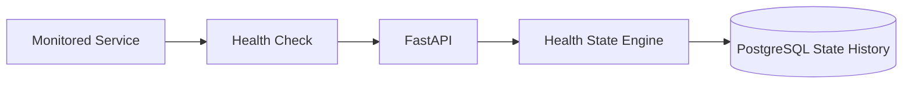

# SentinelOps

SentinelOps is a service-health monitoring portfolio project that records health observations, evaluates operational state over time, and persists deterministic service-state transitions in PostgreSQL.

Phase 1 proves the monitoring core only: service registration, idempotent health-check ingestion, anti-flapping state evaluation, persisted state intervals, and recovery. Alerts, incidents, authentication, dashboards, and a frontend are deliberately out of scope.

## Stack

Python 3.11, FastAPI, SQLAlchemy 2 async, PostgreSQL/asyncpg, Alembic, Pydantic, Docker Compose, and pytest with HTTPX ASGI tests.

## Architecture



Every service begins with a persisted `UNKNOWN` interval. A first success transitions to `HEALTHY`; failed checks keep it `UNKNOWN` until three consecutive failures establish `DOWN`. The active interval is the sole row with `ended_at IS NULL`, protected by a PostgreSQL partial unique index.

## State machine and anti-flapping

| Current | Transition rule |
|---|---|
| HEALTHY → DEGRADED | two consecutive successful checks at ≥500 ms, or two failures in the latest three checks |
| DEGRADED → DOWN | three consecutive failures |
| DEGRADED → HEALTHY | three consecutive successes, all <500 ms |
| DOWN → RECOVERING | first successful check |
| RECOVERING → HEALTHY | three consecutive successes, all <500 ms |
| RECOVERING → DOWN | any failure |

This recent-window/consecutive-check logic prevents a single bad check from trivially flapping the state. Checks are stored in UTC; test scenarios use fixed timestamps. State intervals are added only when the state changes.

## API

- `GET /health` — process liveness, independent of PostgreSQL
- `GET /ready` — PostgreSQL connectivity
- `POST`, `GET /api/v1/services`
- `GET /api/v1/services/{id-or-slug}`
- `POST`, `GET /api/v1/services/{id}/checks`
- `GET /api/v1/services/{id}/health`
- `GET /api/v1/services/{id}/health-history`

`(service_id, external_id)` is the idempotency boundary. Repeated submissions return the already-persisted check with `duplicate: true`; this is deterministic request deduplication, not a claim of distributed exactly-once delivery.

## Run and verify

```bash
cp .env.example .env
docker compose up --build
docker compose exec api python /app/scripts/seed_demo.py
python simulator/payments_scenario.py
```

For a clean end-to-end Codespaces-compatible check, run:

```bash
bash scripts/verify_codespaces.sh
```

The script brings up PostgreSQL and the API, confirms Alembic is at head, seeds services, executes the real Payments API scenario, tests duplicate handling, runs PostgreSQL-backed tests, and removes containers only after success. On failure it leaves containers running for diagnosis.

The included devcontainer runs the Compose API service, forwards ports 8000 and 5432, and enables Docker-in-Docker for Codespaces.

## Limitations

Phase 1 expects checks to be submitted in their observed order. It has no scheduler, active HTTP checker, alerts/incidents, UI, authentication, or cloud deployment. Those are intentionally deferred until the persisted monitoring core is validated.
